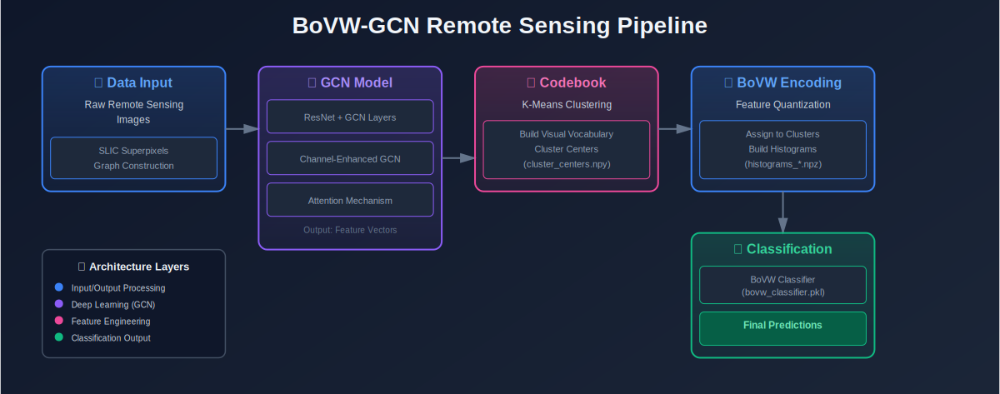
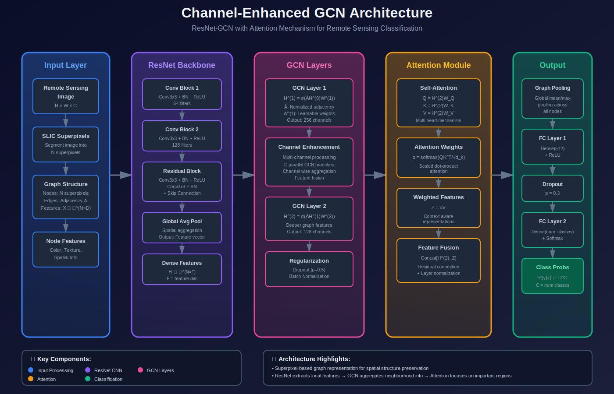

# BOVW-GCN-Remote-Sensing

  
   
   

Bag of Visual Words Feature Extraction Using CNN and GCN for Remote Sensing Image Classification. A complete research-grade implementation combining Convolutional Neural Networks (CNNs) and Graph Convolutional Networks (GCNs) in a Bag-of-Visual-Words (BoVW) framework for robust image representation and classification.
   
   ## 🧩 BOVW Architecture Diagram
   Below is a detailed conceptual overview of the **BoVW-GCN model** architecture:



---

## 🧩 Neural Network Architecture Diagram
Below is a detailed conceptual overview of the **CNN-GCN model** architecture:



   ## 🧰 Environment Setup

To quickly set up the development environment for this project, use the provided setup script.

### 1️⃣ Clone the repository
```bash
git clone https://github.com/montassar-mastour/bovw-gcn-remote-sensing.git
cd bovw-gcn-remote-sensing
```
### 2️⃣ Configure environment variables
```bash
cp .env.example .env
```


### 3️⃣ Run the setup script
```bash
chmod +x setup_conda_env.sh 
./setup_conda_env.sh
```

This will:

- Create a new Conda environment named bovw-gcn

- Activate it and Upgrade pip

- Install all dependencies from requirements.txt

- Install the project in development mode (pip install -e .)

### 3️⃣ Activate the environment (when working later)
```bash
conda activate bovw-gcn
```

   
### 🧪 Testing

To verify that the full pipeline runs correctly end-to-end, use:
```bash
pytest tests/test_complete_pipeline.py -v
```
## 📦 Dataset Preparation
🧰 1️⃣ Get Your Kaggle API Token

To enable automatic dataset download:

Go to your Kaggle account → Settings → API → Click “Create New API Token”

This will download a file named kaggle.json 
Then configure it:
```bash
mkdir -p ~/.kaggle
mv ~/Downloads/kaggle.json ~/.kaggle/
chmod 600 ~/.kaggle/kaggle.json
```
   ## 🚀 Running the Pipeline

You can run the **entire pipeline** automatically or execute any step individually:

```bash
# Run everything
python -m scripts

# Run a specific step (Prepare dataset(download + extract))
python -m scripts --step 00_prepare_dataset
```
For detailed explanations of each step, see
📄 [scripts README](scripts/README.md)


## 🧩 Project Pipeline Overview

| **Step** | **Approx. Duration** | **GPU Required** |
|:----------------------|:----------------:|:----------------:|
| 🧹 **Preprocessing** | ~3 hours | ❌ No |
| 🧠 **GCN Training** | ~8 hours | ✅ Yes |
| ⚙️ **Feature Extraction** | ~1 hour | ✅ Yes |
| 📊 **Codebook Generation** | ~30 minutes | ❌ No |
| 🏋️ **BoVW Training (SVM/RF)** | ~5 minutes | ❌ No |
| 📈 **Evaluation** | ~30 minutes | ✅ Yes |
| **🕒 Total Estimated Time** | **≈ 13 hours** | — |


## ⚙️ Performance Expectations


| Metric | Expected Value | Notes |
|--------|----------------|-------|
| Test Accuracy | 85–92% | On NWPU-RESISC45 dataset |
| GCN Training Time | 6–12 hours | GPU: RTX 3090/V100 |
| Preprocessing Time | ~3 hours | CPU-bound |
| Inference Time | 50–100 ms | Per image (GPU) |
| Throughput | 10–20 img/sec | Single GPU |
| Model Size | ~100 MB | GCN model |
| Memory (Training) | 12–16 GB | GPU VRAM |
| Memory (Inference) | 4–6 GB | GPU VRAM |

---

## ✨ Key Features

## 🔍 Architecture & Features

| Category     | Details |
|-------------|---------|
| **Architecture** | ResNet50 backbone (pretrained), 2-layer GCN with attention, SLIC superpixel segmentation, K-NN graph construction, BoVW with Random Forest |
| **Training**     | AdamW optimizer with weight decay, ReduceLROnPlateau scheduler, Gradient clipping, Checkpoint management, TensorBoard logging, Early stopping support |
| **Features**     | Incremental K-Means for large datasets, Sparse tensor optimization, Batch processing, Multi-GPU ready (minor modifications), Configuration-driven design, Comprehensive logging |
| **Evaluation**   | Confusion matrices, Classification reports, Per-class metrics, Timing analysis, Feature importance visualization, Integrated visualization tools |


   ## 📁 Project Structure
```
   bovw-gcn-remote-sensing/
   ├── config/              # Configuration files
   ├── data/                # Dataset and splits
   ├── models/              # Neural network models
   ├── features/            # Feature extraction
   ├── training/            # Training utilities
   ├── utils/               # Helper functions
   ├── scripts/             # Execution scripts
   ├── notebooks/           # Jupyter notebooks
   ├── tests/               # Unit tests
   └── docs/                # Documentation
```
   
   ## 🔧 Configuration
   
   Edit `config/config.yaml` to customize:
   
   - Dataset paths and parameters
   - Model architecture
   - Training hyperparameters
   - BoVW settings
   

   
   ## 🤝 Contributing
   
   Contributions are welcome! Please:
   1. Fork the repository
   2. Create a feature branch
   3. Make your changes
   4. Submit a pull request
   
   ## 📄 License
   
   This project is licensed under the MIT License - see [LICENSE](LICENSE) file.
   


